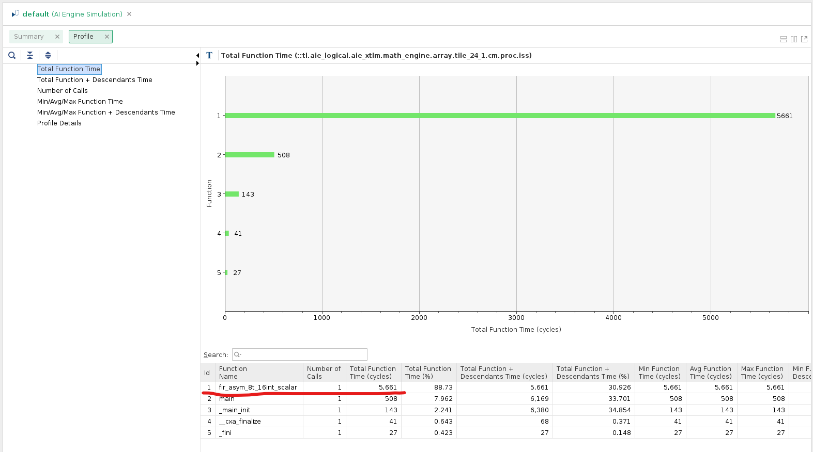
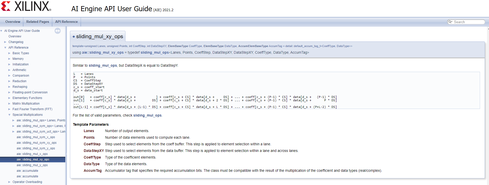
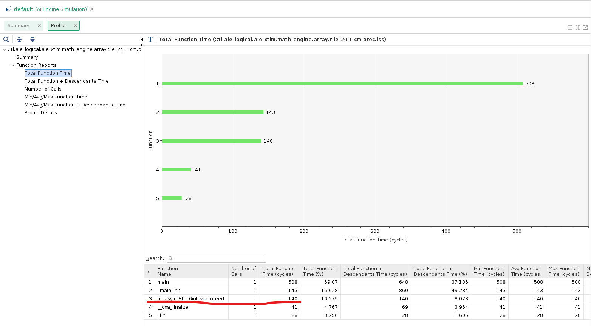

# Introduction
In this lab we will look at how to vectorize an AI Engine kernel code using the AIE APIs to utilize the capabilities of the vector processor. Although the kernel code to be vectorized is a FIR filter, the focus of this article will not be on the FIR filter but on the AIE APIs.

The AI Engine API is a portable interface for AI Engine kernel programming implemented as a C++ header-only library. This API interface will target current and future AI Engine architectures. The AIE APIs are documented in [UG1529](https://www.xilinx.com/htmldocs/xilinx2022_1/aiengine_api/aie_api/doc/index.html)

Note: The attached example is targeting Vitis 2022.1.
 

# FIR Filter
In this lab we will implement an 8 tap single-rate asymmetric FIR filter which can be represented as follows where N represents the number of taps:


Data is sequenced through the filter and at each tap is multiplied by a filter coefficient. 

Scalar Implementation
Using basic C code we can create an implementation of our 8 tap single-rate asymmetric FIR filter.

Note 1: This is a very basic implementation which does not do any saturation of the output data.

Note 2: In the example attached to this lab, the FIR filter is configured to process 256 samples (NUM_SAMPLES = 256).
```C++

#include <adf.h>
#include "kernels.h"
 
int16_t taps[FIR_TAPS] = { 18, 44, 54, 29, -3, -16, -7, 0};
 
void fir_asym_8t_16int_scalar(input_window_int16 * in, output_window_int16 * out)
{
    int16 data[FIR_TAPS];
    int16 acc;
     
    int i, j;
     
    //Initialize the data array
    for( i = 0; i<FIR_TAPS; i++)
    {
        data[i] = 0;
    }
     
    //Main loop
    for( i = 0; i<NUM_SAMPLES; i++)
    {
        acc = 0;
         
        data[0] = window_readincr(in);
         
        //Multiply the samples with the coefficient
        for( j = 0; j<FIR_TAPS; j++)
        {
            acc += data[j] * taps[j];
        }
         
        window_writeincr(out, acc);
         
        //Shift the element of the data array
        for( j = FIR_TAPS-1; j>=0; j--)
        {
            data[j] = data[j-1];
        }      
    }
     
}
```

An AI Engine graph calling this kernel code is included in the attached .zip folder. On a Linux machine, you can build the graph and kernels and run the AIE compiler by running "make all" in the scalar folder (the Vitis 2022.1 environment needs to be properly set up).
```
fir_lab/scalar $ make all
```
We can now check the Vitis Analyzer file which is generated from the simulation output using the following command:
```
fir_lab/scalar $ vitis_analyzer ./Debug/aiesimulator_output/default.aierun_summary
```
If we look at the profile view, we can see the execution time from our kernel (fir_asym_8t_16int_scalar)




We can see that to process the 256 samples, the kernel we have written is taking 5661 clock cycles (or 5.661 us with an AI Engine array running at 1 GHz).

The code above is not using any vectorized operation so it will only run on the scalar unit of the AI Engine tile the kernel is running on. We can get much better performance using the vectorized processor. For this we need to use the AIE APIs which will give us the ability to run vectorized operations.

Vectorized Implementation
Now we will see how we can vectorize our code using the AIE APIs. 

Looking into AIE APIs documentation (UG1529), we can find the API sliding_mul_xy_ops which implements the type of multiplication we are looking for.
 



  The sliding_mul_xy_ops API requires multiple parameters:
 

### Lanes
The number of lanes corresponds to the number of output values that will be generated from the operation. For int16*int16 operations, 2 values are possible 8 or 16. In our example, we will use 8 lanes.
### Points
This is the number of data point to be used to compute each lane. As we have am 8 taps fir, we need 8 data samples to compute each output sample
### CoeffStep
This is the step used to select the elements from the coefficient buffer. We are going through all of the coefficients, so we are using a step of 1
### DataStepXY
This is the step used to select the elements from the data buffer. We are processing all of the samples consecutively, so we are using a step of 1
### CoeffType
This is the data type for the coefficient elements. We will set it to int16
DataType
This is the data type for the data elements. We will set it to int16

To feed the sliding multiply operation API, we need a vector of 16 data samples.

It can be declared as below:
```
aie::vector<int16, 16> data;
```
To load the data vector with the input samples we can use the window_readincr_v<8>(in) API (documented in (UG1076)) to read 8 samples from the input window and use the insert() API to insert this data into the vector:
```
data.insert(1, window_readincr_v<8>(in));
```
The fully vectorized code is shown below:
 
```C++
#include <adf.h>
#include "aie_api/aie.hpp"
#include "aie_api/aie_adf.hpp"
#include "kernels.h"
 
static constexpr int16_t taps[FIR_TAPS] = { 0, -7, -16, -3, 29, 54, 44, 18};
 
void fir_asym_8t_16int_vectorized(input_window_int16 * in, output_window_int16 * out)
{
    aie::vector<int16, 16> data;
    const aie::vector<int16, 8> coeff = aie::load_v<8>(taps);
    aie::accum<acc48, AIE_MUL_LANES> acc0;
     
    constexpr unsigned CoeffStep    = 1;
    constexpr unsigned DataStepXY   = 1;
    constexpr unsigned CoeffStart   = 0;
     
     
    using mul_ops = aie::sliding_mul_xy_ops<AIE_MUL_LANES, FIR_TAPS, CoeffStep, DataStepXY, FIR_T_COEFF , FIR_T_DATA>;
     
    data = aie::zeros<int16, 16>();
     
    //Main loop
    for( i = 0; i<LOOP_CYCLES; i++)
    {
        // Read 8 samples and insert then in the second part of the data vector
        data.insert(1, window_readincr_v<8>(in));     // 0...0 | d0..d7
        //Run multiply operation
        acc0 = mul_ops::mul(coeff,CoeffStart,data,1) ;
        //Output 8 samples
        window_writeincr(out, acc0.to_vector<int16>());
 
        // Read the next 8 samples and insert them in the first part of the data vector
        data.insert(0, window_readincr_v<8>(in));     // d8...d15 | d0..d7
        //Run multiply operation
        acc0 = mul_ops::mul(coeff,CoeffStart,data,9) ;
        //Output the next 8 samples
        window_writeincr(out, acc0.to_vector<int16>());
    }
     
}
```

An AI Engine graph calling this kernel code is included in the attached .zip folder. On a Linux machine, you can build the graph and kernels and run the AIE compiler by running "make all" in the vectorized folder (the Vitis environment needs to be properly set up).
```
fir_lab/vectorized $ make all
```
We can now check the Vitis Analyzer file which is generated from the simulation output using the following command:
```
fir_lab/vectorized $ vitis_analyzer ./Debug/aiesimulator_output/default.aierun_summary
```
If we look at the profile view, we can see the execution time from our kernel (fir_asym_8t_16int_vectorized):
 

 

We can see that to process the 256 samples, the vectorized kernel is taking 140 cycles (or 140ns with an AI Engine array running at 1 GHz) which is 40 times better than with the scalar version.

Note: The kernel can be further improved to reduce even more the execution time. However, this is not covered in this lab. 

# Conclusion

In this lab we have seen how to write a vectorized version of a basic asymmetric FIR filter kernel to run on the AI Engine using the AIE APIs in order to utilize the capabilities of the vector processor of the AI Engine.
